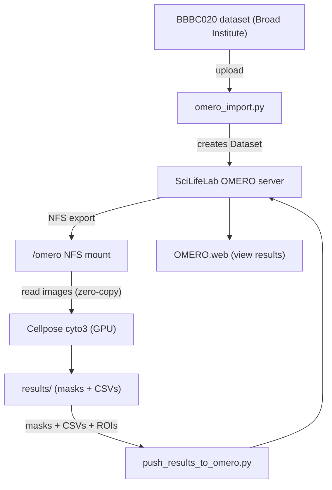

# From Microscope to GPU: Bioimage Analysis with Cellpose

**WASP/DDLS Workshop — 7 May 2026**

End-to-end bioimage analysis pipeline: access a public microscopy dataset,
run GPU-accelerated cell segmentation with [Cellpose](https://cellpose.readthedocs.io),
extract per-cell measurements, and manage images and results through
[OMERO](https://omero.readthedocs.io).

Two tracks are provided:

| Track | Runtime | OMERO required? |
|-------|---------|-----------------|
| **Google Colab notebook** | Free Colab T4 GPU | No |
| **HPC + OMERO scripts** | ALVIS cluster (a SLURM cluster with GPU) | Yes |

---

## Pipeline Overview



---

## Repository Contents

| File / Directory | Description |
|------------------|-------------|
| `WASP-DDLS_colab_notebook.ipynb` | Self-contained Colab notebook — downloads the dataset, segments, and visualizes results (no OMERO needed) |
| `cellpose_omero_nfs.py` | GPU segmentation script that resolves image paths from OMERO via NFS and runs Cellpose |
| `push_results_to_omero.py` | Uploads masks, measurement CSVs, and polygon ROIs back to OMERO images |
| `omero_import.py` | Imports a folder of images into OMERO as a new Dataset using the `omero` CLI |
| `utils.py` | Shared helpers: BBBC020 image discovery, channel loading, measurement extraction, OMERO connection |
| `slurm_job.sh` | SLURM batch script template for the ALVIS HPC cluster |
| `requirements.txt` | Python package dependencies |
| `BBBC020_v1_images/` | Sample images from the BBBC020 dataset (for local testing) |

---

## Quick Start: Google Colab
This notebook is to show the workflow of the pipeline in Google Colab. It does not contain dataset import and result push-back to OMERO.

1. Upload `WASP-DDLS_colab_notebook.ipynb` to [Google Colab](https://colab.research.google.com).
2. Select **Runtime → Change runtime type → T4 GPU**.
3. Run all cells. The notebook will:
   - Install dependencies
   - Download the BBBC020 dataset
   - Segment all 25 images with Cellpose on GPU
   - Produce per-cell measurements and visualizations

No OMERO access or local setup is required.

---

## HPC + OMERO Workflow

### Prerequisites

- Python 3.11+ with a virtual environment
- GPU access (e.g. ALVIS cluster)
- Network access to the OMERO server (`omero.scilifelab.se`)
- NFS mount of the OMERO managed repository at `/omero` (for `cellpose_omero_nfs.py`)
- The `OMERO.server-5.6.17-ice36` client bundle (needs to be downloaded and unzipped), necessary for `omero_import.py`.

### 1. Environment setup

```bash
python -m venv venv
source venv/bin/activate
pip install -r requirements.txt
```

On ALVIS, load the required modules first:

```bash
module load GCC/12.3.0 CUDA/12.1.1 Python/3.11.3-GCCcore-12.3.0 Java/11.0.27
```

### 2. Import images into OMERO

Upload local images to the OMERO server as a new Dataset:

```bash
export OMERODIR=$(pwd)/OMERO.server-5.6.17-ice36

python omero_import.py \
    --server omero.scilifelab.se \
    --user <username> \
    --password <password> \
    --project-id <project-id> \
    --dataset "My Dataset" \
    --path /path/to/images
```

### 3. Run segmentation

**Interactive:**

```bash
python cellpose_omero_nfs.py \
    --dataset-id <dataset-id> \
    --output-dir results/omero_nfs
```

**Via SLURM:**

Edit the placeholder values in `slurm_job.sh` (account, reservation, paths),
then submit:

```bash
sbatch slurm_job.sh <dataset-id> results/omero_nfs
```

This resolves image file paths from OMERO, reads them directly off the NFS
mount, and runs Cellpose `cyto3` on GPU. Outputs are written to the specified
results directory.

### 4. Push results back to OMERO

Attach masks, measurement CSVs, and polygon ROIs to the corresponding OMERO
images:

```bash
python push_results_to_omero.py \
    --dataset-id <dataset-id> \
    --results-dir results/omero_nfs
```

Add `--skip-rois` to skip ROI contour upload (faster if you only need file
attachments).

Results are then viewable in OMERO.web at
`https://omero.scilifelab.se/webclient/?show=dataset-<dataset-id>`.

---

## Dataset

[BBBC020](https://bbbc.broadinstitute.org/BBBC020) is a public dataset from
the Broad Bioimage Benchmark Collection containing fluorescence images of
murine bone-marrow derived macrophages at different
timepoints.

Each image set has two channels:

- `_c1.TIF` — Hoechst 33342 (nuclei)
- `_c5.TIF` — Phalloidin-TRITC (actin / cell body)

25 image sets span 6 conditions: 15 min, 30 min, 1 h, 2 h, 24 h, and
Kontrolle (untreated control).

---

## Resources

| Resource | Link |
|----------|------|
| SciLifeLab OMERO | https://omero.scilifelab.se |
| OMERO documentation | https://omero.readthedocs.io |
| Cellpose documentation | https://cellpose.readthedocs.io |
| BBBC020 dataset | https://bbbc.broadinstitute.org/BBBC020 |
